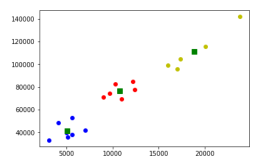

# DATA 531 - Programming for Data Science
# Lab 2: Python Files and Modules for Data Analysis

## Objectives

1. Fluency in reading and writing text (CSV) files including using try-except to handle exceptions.
2. Practice using matplotlib charting library to construct bar and histogram charts.
3. Experience analyzing real-world, open data sets.
4. Ability to retrieve files from web sites using Python code.
4. Using modules pandas, numpy, and scipy for executing a data analysis workflow including data loading, cleaning, filtering, analysis (linear regression, k-means clustering, charting), and writing results to a file.

## Question #1 - Data Analysis of GDP Data Stored as a CSV File (5 marks)

Create a Python program that uses the open data set on GDP from the Canadian government [36100293.csv](data/36100293.csv) ([Original data source](https://open.canada.ca/data/en/dataset/b0c4a8e1-bb44-4ea8-a389-a3a6b87573aa)) to answer some GDP questions and produce a graph. Details: 

- Put a comment at the top of the Python file called ``lab2q1`` with your name. (0.5 marks)
- Insure the data file [36100293.csv](data/36100293.csv) is in your code directory for input. There is also a metadata file [36100293_MetaData.csv](data/36100293_MetaData.csv) providing info on the data file (not required to use).
- Create an empty dictionary that will eventually have the year as a key and the GDP for that year as a value. Create two empty lists to store year and GDP data. (0.5 marks)
- Read the data file using the ``csv`` module and store the GDP for each year in the dictionary and the year and GDP in each list. Code must use try-except to handle any error. Note that this data set has lots of data besides GDP so you will need to determine which rows store GDP values. (1 mark)
- Prompt the user for a year and output the GDP for that year from the dictonary. (1 mark)
- Calculate and print the GDP change from the user year and the GDP in the 1970. (1 mark)
- Create a line chart using matplotlib showing the GDP from 1961 to 2011. [matplotlib line chart example code](https://matplotlib.org/3.1.1/gallery/lines_bars_and_markers/simple_plot.html) Use the GDP and year lists created previously for the chart data. (1 mark)

### Sample Output

    Enter a year to lookup GDP: 1965
    GDP in 1965 was 17.2 billion dollars which is -20.000000000000004 % different than 1970.

## Question #2 - Data Analysis Pipeline using Python Modules (15 marks)

Create a Python program that reads data on Canadian household incomes from open data web site ([Data source](https://open.canada.ca/data/en/dataset/a932e23b-6480-404d-9d15-708dc9cf9b81)) and performs analysis and reporting. Details:

- Put a comment at the top of the Python file called ``lab2q2`` with your name. 
- The data source URL is [https://www150.statcan.gc.ca/n1/tbl/csv/11100032-eng.zip](https://www150.statcan.gc.ca/n1/tbl/csv/11100032-eng.zip). Download zip file using ``urllib.request`` A method called ``urlretrieve`` may be deprecated in the future but is very easy to use for this. (1 mark) [Reference example for urllib](https://stackoverflow.com/questions/7243750/download-file-from-web-in-python-3)
- Unzip the file using ``zipfile`` module and ``extractall`` method. (1 mark) [zipfile reference](https://docs.python.org/3/library/zipfile.html) and [zipfile extractall example](https://thispointer.com/python-how-to-unzip-a-file-extract-single-multiple-or-all-files-from-a-zip-archive/) Note: Once you have the data downloaded and unzipped, comment out this code until submission so you do not keep downloading the data!
- Use ``pandas`` module and ``read_csv`` method to read CSV file. (1 mark)
- Filter the data to include only ``Canada`` data and print the number of rows. (2 marks)
- Produce two subsets of the data: 
    1. All data rows with ``Average total income``.
    2. All data rows with ``Average income tax``.
- Print out number of rows in each data set and use ``head(4)`` to print out first 4 rows in tax data set (showing only ``Income concept`` and ``VALUE`` columns.) [Pandas reference](https://pandas.pydata.org/pandas-docs/stable/indexing.html) (3 marks)
- Perform and graph the output for a linear regression ``(tax, income)`` on the ``VALUE`` column for these two data subsets. (2 marks)
- Create a ``matplotlib`` bar chart with bars for ``tax`` and ``income`` and x-axis labels the family categories (``Economic family type``). Note: To resize figure larger use: ``plt.figure(figsize=(6,6))`` (2 marks)
- Perform a k-means clustering with 3 clusters and graph results. Use sample code in notes with slight modification. (3 marks)

### Sample Output

    Number of data rows for Canada: 216
    Number of data rows: 18
    Number of data rows: 18
         Income concept    VALUE
    108  Average income tax  12400.0
    109  Average income tax  16000.0
    110  Average income tax   9700.0
    111  Average income tax   9000.0
    

